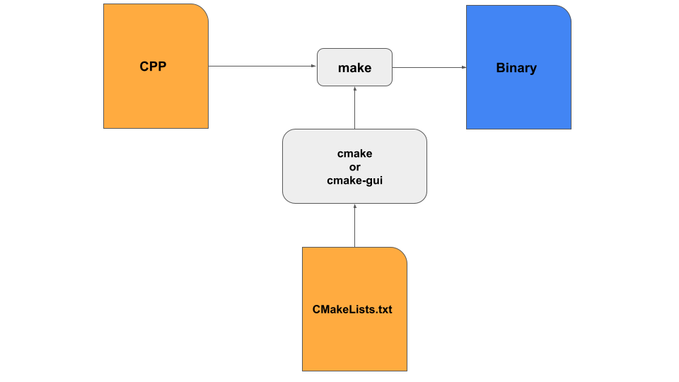

## A set of tutorials to introduce students to the CMake generator 

Experimental High Energy Physics School on Software Development 2024, TIFR, Mumbai

https://indico.tifr.res.in/indico/conferenceDisplay.py?confId=9018

Deepak Samuel  

Central University of Karnataka

---
**Quick Introduction:**

Any C++ programme that you write is in human readable format. However, computers are digital devices and can understand only binary language. The process of converting your programme text to binary form is technically called compiling, which is done by a compiler (which in itself is another programme!).

The compiler needs instructions to carry out the conversion from text to binary executable. For example, it needs to be told:

a. which files to be compiled  
b. the location of these files  
c. which libraries to be linked to (and their locations)   
d. which order the compilation should take place  

Usually these instructions given in what is called as the **Makefile**. In a large programme, writing these Makefiles may be cumbersome and errorprone. CMake is a programme (a build-system generator) that makes the creation of Makefiles a lot easier. It uses files called as **CMakeLists.txt** which are easier to understand and write, from which the Makefiles are in turn created. 

**cmake-gui** is a programme that makes the handling of CMakeLists.txt easier. It reads a the  CMakeLists.txt in a source directory and presents them in a user friendly interface. 

The process of compiling goes like this:  
1. Write the programme
2. Create approprate CMakeLists.txt
3. Run **cmake** or **cmake-gui** with approriate inputs 
4. Run **make**
5. Run your programme

In many cases you will develop your code from an existing example which already has a CMakeLists.txt for you, in which case you can skip step 2.



See this link for more interesting examples:  
https://hsf-training.github.io/hsf-training-cmake-webpage/03-cmakelists/index.html

All tutorials are in the tutorials folder 
# Tutorial 1: A simple example (simple):

This is a very basic example for which cmake is not even required. However, it will help you understand how cmake work at the very basic level.

First I will demonstrate how to compile this code directly and then I will show how cmake is used to compile it.

## 1. Compiling directly:

cd to the simple folder inside of which you will find simple.cpp. Now issue the following command:

```g++ simple.cpp```  

This is command that compiles your code and creates the binary.

Now you should find a new file created: **a.out** . This is the binary or the excutable. You can run the programme by issuing this command:


```./a.out```

This should run your programme and the following should be printed on your terminal:

***Welcome to EHEP school!***

## 2. Building using cmake and compiling:

In the simple folder you will find this file **CMakeLists.txt** with the following content:

``` 
cmake_minimum_required(VERSION 3.15)
project(ehep-cmake-01)
add_executable(ehep-tutorials simple.cpp)
```
**The first line**

```cmake_minimum_required(VERSION 3.15)```

tells that for this code you require a minimum cmake version of 3.15. If your computer has a lower version, cmake might fail. Of course, it is upto you to change the version. 

**The second line**

```project(ehep-cmake-simple))```

gives the project a name. You can give a name that you like. 


**The last line:**

```add_executable(simple simple.cpp)```  

tells cmake that you want your code **simple.cpp** to be converted to an executable named **simple**. Note that in our first example, the executable was named a.out and you can also replace ehep-tutorials by **a.out**, if you like.

---  

## Running cmake   
As mentioned earlier, to create the **makefile**, you have to run **cmake**:

Run the following command inside the simple folder 

```cmake .```

Notice the dot next to cmake. The dot in Linux means current directory and a double dot means the previous directory.

The above command tells cmake to use the CMakeLists.txt in the current directory. Once the command is issued you will see a host of files being generated along with the **MakeFile**. 


## Running make

To create the executable, you need to run the **make** command. This command makes use of MakeFile to generate the executable. 


Run the following command inside the simple folder  

```make```

Now you should see the executable named **simple** being created.

## Running your program

Now that your executable is created, you can run your programme:

```./simple```

At this point you may feel that using cmake is an overkill but you will see its use in complex code bases and its very rare to see large codebases not using cmake system. ROOT and Geant4 are good examples!

**Please note that everytime you edit your code, you have to compile the code by running make, before running your programme. However, you do not need to run cmake everytime. It needs to be done only once. However, if you are changing the structure of your codebase, for example, adding new folders or files, you may have to rerun cmake.**  


## Tutorial 2: A little complex example (multiple):

This example demonstrates the typical use of cmake. In the folder multiple, you will see a file named **main.cpp** and a **CMakeLists.txt**. You will also find a folder named **src** and **include**. Inside the **src** folder you will find another **CMakeLists.txt** .   


The **include** folder has a file named **ehep.h** in which two functions called add and subtract are **declared**.

The **src** folder has a file named **ehep.cpp** in which the two functions  are **defined**.

What we want to do is to build a **library** named **ehep** which contains functions to add or subtract two numbers.

We want this library to be used in our main code in **main.cpp**. We call this as **linking**.

The **CMakeLists.txt** inside src folder has the following lines:

```
add_library(ehep ehep.cpp)    
target_include_directories(ehep PUBLIC ../include)
```
The first line indicates that we want to build a library called **ehep** from the file **ehep.cpp**. 

The second line indicates to search for header files in the **include** folder. 
If this line is not included, the header file **ehep.h** should be included along with the full path 

```# include \home\Desktop\cmake-tutorials\tutorials\multiple\ehep.h```


This is ofcourse tedious and not preferred. For, whenever you move your source code, all the paths have to be rewritten!

The above two lines will create the library ehep which contains the add and subtract functions. 

In Linux, libraries are created with a **lib** prefix and a **.a** suffix. So when make is run, you should see a file named **libehep.a**.

The **CMakeLists.txt** in the parent directory is similar to the one used in the simple example, with few minor modifications.


```
cmake_minimum_required(VERSION 3.15...3.21)
project(ehep-cmake-multiple)
add_subdirectory(src)
add_executable(multiple main.cpp)
target_link_libraries(multiple ehep)
```

The first line indicates that you need cmake of any version between 3.15 and 3.21. 

Te second lines assigs a project name.

The third line **add_subdirectory(src)** adds the **src** subdirectory to the project. At this point of addition, cmake searches for **CMakeLists.txt** in src folder and creates the ehep library.

The fourth line **add_executable** creates an executable from the file **main.cpp**. It is in the **main.cpp** that we call the add function (which is defined in the **ehep.cpp** file).

The last line target_link_libraries links the **ehep** library to the executable. 

To run the programme, issue the following commands inside **multiple** folder:

```
cmake .  
make  
./multiple  
```

## Assignments:
a. Go through the contents of the Makefile.  
b. Verify if the **libehep.a** file was created and check where it was created.  
c. Full assignment (cmake-a1):
- Add two folders **src2** and **include2** inside the **multiple** folder and using a create a **ehep2.cpp** inside src2 and **ehep2.h** in include2 folder. 
- *Declare* a product function that will take two floats and return a float in **ehep2.h**. *Define* the product function in **ehep2.cpp**.
- Now create a **CMakeLists.txt** inside the src2 folder to create the ehep2 library. 
- Modify the **main.cpp** to compute the product of two functions.
- Modify the **CMakeLists.txt** in the parent folder appropriately to add the appropriate subdirectory and to link to the ehep2 library
- Demonstrate that you can run the code successfully!


## Tutorials 3: Linking external libraries - ROOT

This example shows how to link to external libraries like ROOT which are already compiled and installed on your computer. The example is in folder **root**.

The CMakeLists.txt file has the following contents:

```
cmake_minimum_required(VERSION 3.15)
project(ehep-root-basic)
find_package(ROOT 6.28 CONFIG REQUIRED)

add_executable(basic-root main.cpp)
target_link_libraries(basic-root PUBLIC ROOT::Gui ROOT::Core)
```
The main line to note here is:

```find_package```

This line searches for ROOT version 6.28 and the REQUIRED keyword is used here to tell that this code will not compile without it.

All major open source softwares like ROOT, Geant4 etc., make sure that they can be identified by this function. If cmake is not able to find it the code will not be compiled. 

For cmake to identify ROOT on your system, you should ensure that **thisroot.sh** is sourced before cmake is called.

The next line to note is the 

```target_link_libraries```

In this line you are linking to the ROOT Gui and Core libraries. The list of ROOT libraries can be obtained by typing:

```root-config --libs```

To run the programme, use the following commands:

```
cmake .
make
./basic-root
```

For more details on ROOT with cmake, please refer to the following links:

https://root.cern/manual/integrate_root_into_my_cmake_project/
https://cliutils.gitlab.io/modern-cmake/chapters/packages/ROOT.html

## Tutorial 4: Linking to Geant4 libraries

You can find this example inside g4 folder. Please note that this tutorials is only to demonstrate how cmake works. This programme is a dummy programme and does not perform any geant4 simulations as such. Since you will most probably copy an existing example and build your code, you will be using an existing CMakeLists.txt. For an advanced example, please refer to example B1 and see how the CMakeLists.txt looks like.

The CMakeLists.txt for this tutorials looks like this:

```cmake_minimum_required(VERSION 3.16...3.27)
project(ehep-g4-basic)
find_package(Geant4 REQUIRED)
# Setup Geant4 include directories and compile definitions
include(${Geant4_USE_FILE})
add_executable(basic-g4 main.cpp)
target_link_libraries(basic-g4 ${Geant4_LIBRARIES})
```

Geant4 is checked using the find_package. For this to work you should have sourced your geant4.sh file. 

The **include(${Geant4_USE_FILE})** ensures that the Geant4 header file locations are automatically found. 

In ```target_link_libraries(basic-g4 ${Geant4_LIBRARIES})```, the ${Geant4_LIBRARIES} contains the path to Geant4 libraries (through the find_package function)

---